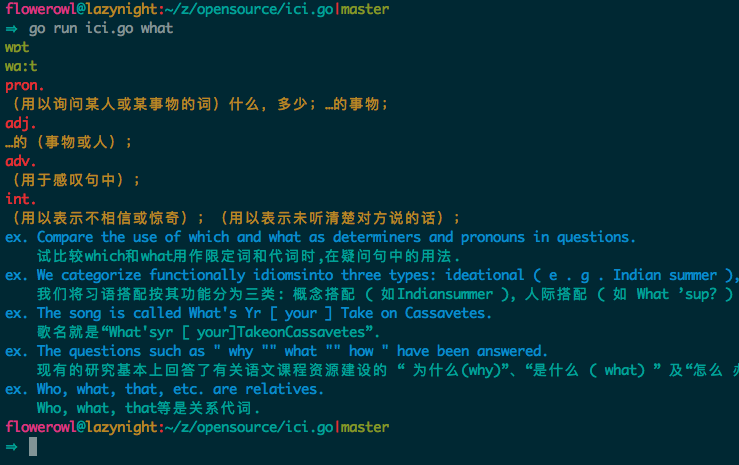

# ici.go
A Golang implementation of the Ici(https://github.com/Flowerowl/ici)

# Run

go run ici.go what

# Other Versions

* Python <https://github.com/Flowerowl/ici>

* Vim <https://github.com/Flowerowl/ici.vim>
